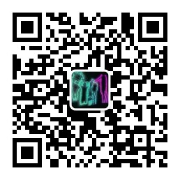
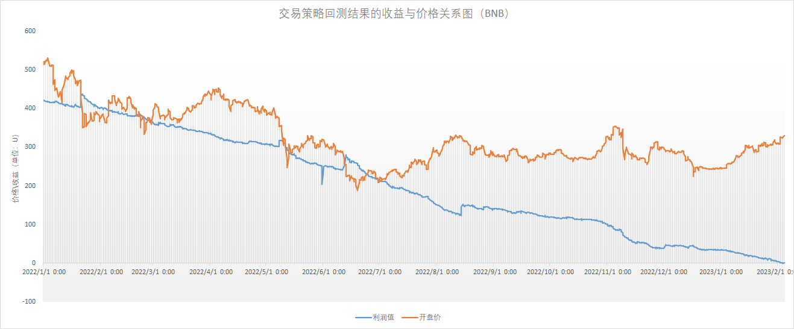
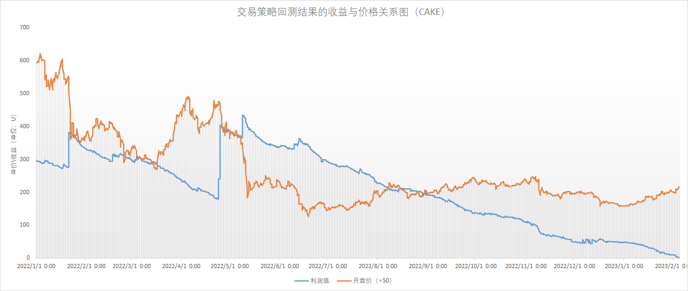

# Python量化交易实验代码

基于python的币圈量化交易实验项目，next2.0版本。

微信公众号：NextB

二维码：



## 一、安装命令

```
pip install nextbv2
```

## 二、使用命令

|命令行|功能|使用方式|
|----|----|----|
|nextb-v2-data-process|NextBv2下载、更新本地数据集工具|详细情况，使用`-h`参数查看|
|nextb-v2-data-statics|NextBv2本地数据集统计分析工具|详细情况，使用`-h`参数查看|
|nextb-v2-trade-simulation|NextBv2本地仿真交易、回归测试工具|详细情况，使用`-h`参数查看|
|nextb-v2-trade-online|NextBv2线上交易工具|详细情况，使用`-h`参数查看|
||||

## 三、配置文件与参数

### 3.1 程序配置文件

`nextb-v2-data-process`和`nextb-v2-trade-online`命令的`-c`参数使用该配置

```ini
[NEXTBV2_CONFIG]
API_KEY = 123
API_SECRET = 123
KLINES_INTERVAL = 1h
LIMIT = 1000
START_TIME = 1640966399000
PROXY = on
HTTP_PROXY = http://127.0.0.1:7890
HTTPS_PROXY = http://127.0.0.1:7890
SYMBOLS = BNBUSDT
DATA_PATH = ./datas/serialize.data
SQLITE_PATH = ./datas/trade.db
```

* API_KEY：币安的api_key
* API_SECRET：币安的api_secret
* KLINES_INTERVAL：K线类型，取值包括：1m，3m，5m，15m，30m，1h，4h等
* LIMIT：每次请求数据上限值，取值范围[1, 1000]                           
* START_TIME：13位的时间戳，默认2022-01-01 00:00:00
* PROXY：是否使用代理，on：使用，off：不使用
* HTTP_PROXY：http类型代理地址
* HTTPS_PROXY：https类型代理地址
* SYMBOLS：需要获取的币种名称，币种间使用","隔开，如：BTCUSDT,ETHUSDT,BNBUSDT
* DATA_PATH：本地数据集保存路径
* SQLITE_PATH：交易数据存储路径

### 3.2 交易参数配置

`nextb-v2-trade-simulation`和`nextb-v2-trade-online`命令的`-tc`参数使用该配置。以下参数已经过调试，建议直接使用。

```json
{
  "symbol": "BNBUSDT",
  "base": 100.0,
  "down": 1,
  "decline": 0.03,
  "magnification": 1.0,
  "max_quote": 1500,
  "profit_ratio": 0.013,
  "force_buy": false,
  "user": "nextb"
}
```

* symbol：指定交易币种
* base：单次投入金额、单次追加投入金额
* down：价格连续下跌次数
* decline：价格下跌幅度
* magnification：每次投入金额、追加投入金额的倍数
* max_quote：最大投入金额
* profit_ratio：收益率
* force_buy：不考虑策略，只要空仓，则强制买入
* user：用户名

## 四、回测结果

### 4.1 BNBUSDT回测结果

回测结果如下：

* 回测时间：2022.01.01 00:00:00 - 2023-02-04 10:00:00
* 交易次数：341次
* 获利：421.482U
* 最大投入金额：1100.0U
* 平均投入成本：207.625U
* 平均利润率：203.0%

资金使用情况如下：

|资金（单位：U）|使用次数|占比|
|----|----|----|
|100|202|59.24%|
|200|58|17.01%|
|300|30|8.8%|
|400|19|5.57%|
|500|7|2.05%|
|600|7|2.05%|
|700|7|2.05%|
|800|5|1.47%|
|900|3|0.88%|
|1000|2|0.59%|
|1100|1|0.29%|



### 4.2 CAKEUSDT回测结果

回测结果如下：

* 回测时间：2022.01.01 00:00:00 - 2023-02-04 10:00:00
* 交易次数：536次
* 获利：677.802U
* 最大投入金额：2600.0U
* 平均投入成本：268.47U
* 平均利润率：252.47%

资金使用情况如下：

|资金资金（单位：U）|使用次数|占比|
|----|----|----|
|100|303|56.53%|
|200|87|16.23%|
|300|47|8.77%|
|400|30|5.6%|
|500-700|10|1.87%|
|800|8|1.49%|
|900|5|0.93%|
|1000|4|0.75%|
|1100|3|0.56%|
|1200-1500|2|0.37%|
|1600-2600|1|0.19%|

